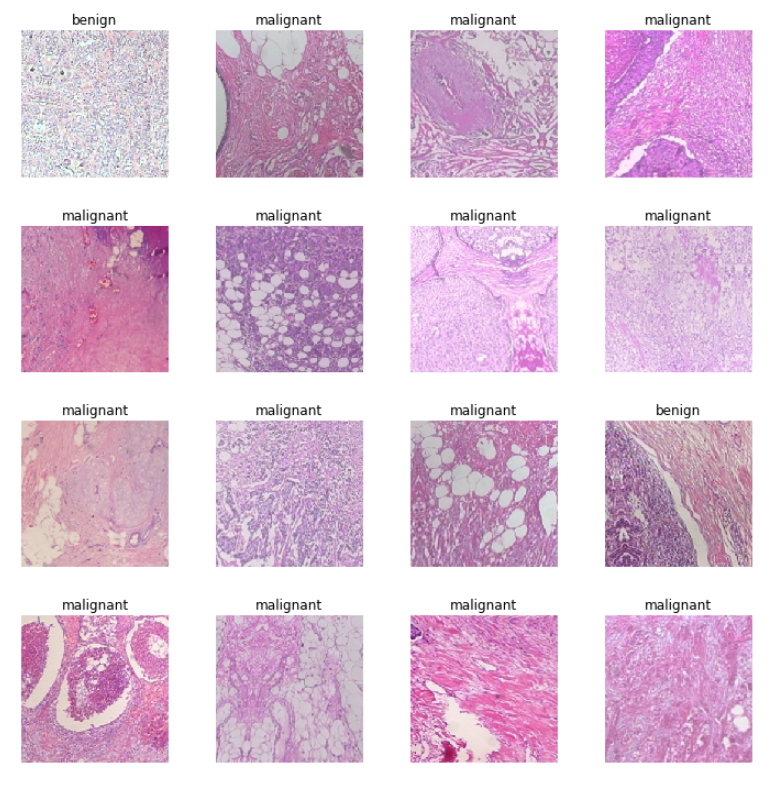
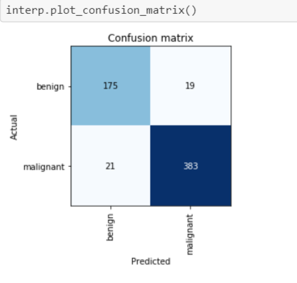

# About
[Breast cancer is the most common cancer in American women except for skin cancers](https://www.cancer.org/cancer/breast-cancer/about/how-common-is-breast-cancer.html) and according to the [World Cancer Research Fund](https://www.wcrf.org/dietandcancer/cancer-trends/breast-cancer-statistics) there were over 2 million new cases in the year 2018. Breast cancer detection is a highly time-consuming task and it is dependent on the expertise of pathologists. With the rapid advancements of Machine Learning and Deep Learning, computer-aided diagnosis (CAD) can be a useful support to pathologists.

# Dataset
[Spanhol et al.](http://www.inf.ufpr.br/lesoliveira/download/TBME-00608-2015-R2-preprint.pdf) published the [Breast Cancer Histopathological Database (BreakHis)](https://web.inf.ufpr.br/vri/databases/breast-cancer-histopathological-database-breakhis/) in 2016. 

From the dataset's webpage:

*The Breast Cancer Histopathological Image Classification (BreakHis) is  composed of **9,109 microscopic images of breast tumor tissue** collected from 82 patients using different magnifying factors (40X, 100X, 200X, and 400X).  To date, it contains **2,480  benign and 5,429 malignant** samples (700X460 pixels, 3-channel RGB, 8-bit depth in each channel, PNG format).*

*The dataset BreaKHis is divided into two main groups: **benign** tumors and **malignant** tumors. Histologically benign is a term referring to a lesion that does not match any criteria of malignancy – e.g., marked cellular atypia, mitosis, disruption of basement membranes, metastasize, etc. Normally, benign tumors are relatively “innocents”, presents slow growing and remains localized. Malignant tumor is a synonym for cancer: lesion can invade and destroy adjacent structures (locally invasive) and spread to distant sites (metastasize) to cause death.*

The dataset is structured as follows:

| Magnification  | Benign    | Malignant | Total | 
|----------------|-----------|-----------|-------|
| **40x**   | 652 | 1,370 | 1,995 |
| **100x**  | 644 | 1,437 | 2,081 |
| **200x**  | 623| 1,390 | 2,013 | 
| **400x**  | 588 | 1,232 | 1820 |
| **Total** | **2,480** | **5,429** | **7,909** |

To simplify things, I will only use the images with the **40x magnification** in my experiments. That means we will try to train a classifier with only 1,995 images in total. [Spanhol et al. (2016)](http://www.inf.ufpr.br/lesoliveira/download/TBME-00608-2015-R2-preprint.pdf) achieved an accuracy of 83.8% on the 40x magnication images with their best classifier. Note that they wrote their paper in 2016, so let's see what accuracy we can achieve with recent Deep Learning developments like transfer learning or data augmentation! 

# Classification Model
Like in Spanhol et al.'s paper, we will split the dataset in a 70/30 split. That means we have **1397 training images** and **598 validation images**. We will use a pre-trained Convolution Neural Network (in this case resnet50) to use the benefits of transfer learning. We apply data augmentation as well, since slight rotation or flips of pathology images should be fine. Moreover, thanks to the efficient implementation of the fastai library (like the [1cycle policy](https://docs.fast.ai/callbacks.one_cycle.html#What-is-1cycle?) of varied learning rates and other optimizations during training time), we can train a top classifier in just a few minutes.

# Results
On the 40x magnification set, we achieve an accuracy of **93.31%** which is almost 10% higher than in the original paper. Total training time was under 10 minutes.

Confusion matrix:

Especially in cancer diagnosis, the right measure/metric is of uttermost importance. Accuracy alone is not sufficient to tell if a screening model is good enough or not. Sensitivity (also known as recall) and specifity are two important metrics. According to the [WHO](https://www.who.int/cancer/detection/variouscancer/en/):

**Sensitivity**: the effectiveness of a test in detecting a cancer in those who have the disease.

**Specificity**: the extent to which a test gives negative results in those that are free of the disease.

*A screening test aims to be sure that as few as possible with the disease get through undetected (high sensitivity) and as few as possible without the disease are subject to further diagnostic tests (high specificity).*

Our model output the following metrics:

| Metric         | Score in %   |
|----------------|--------------|
| **Precision**   | 95.3% |
| **Sensitivity**  | 94.8% | 
| **Specificity**  | 90.2% |
| **F1** | 95.0% |

Since all of our metrics are about and above 90%, we can say that our classifier has [high enough credibility.](https://en.wikipedia.org/wiki/Sensitivity_and_specificity)

# Summary
We trained a breast cancer classification model on the "Breast Cancer Histopathological Database (BreakHis)" dataset. On the 40x magnification images (1397 training images and 598 validation images), we achieve an accuracy of **93.31%** which is almost 10% higher than in the original paper from 2016. Our other metrics like precision, sensitivity or specificity are also in the 90% range which makes this classifier acceptable enough. Thanks to the efficient fastai libray, we also trained the whole model in less than 10 minutes in total which shows the rapid advancement in Deep Learning in the last years.
